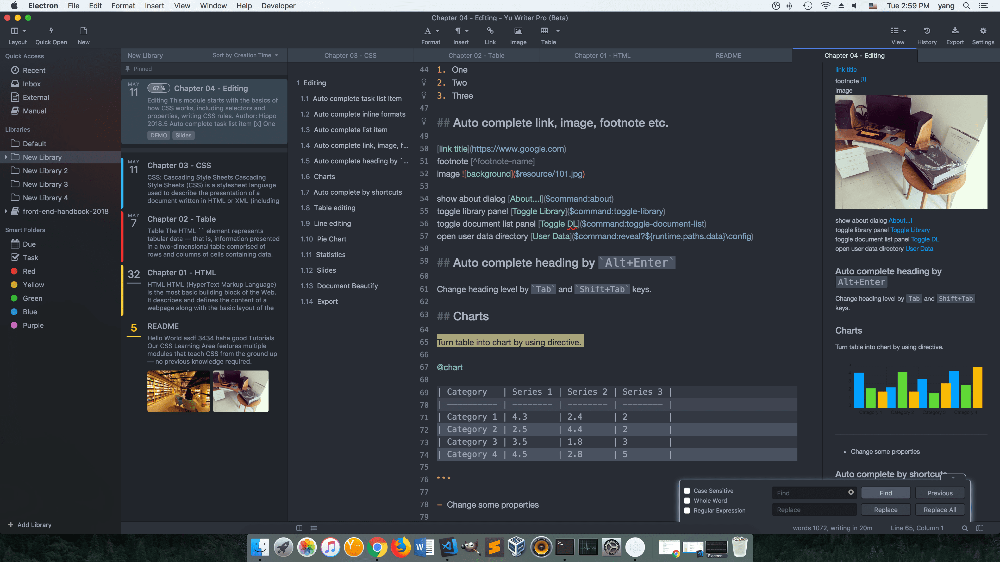

# 关于 Yu Writer

## 欢迎

Yu Writer 是一款高效、流畅、跨平台的 Markdown 文本编辑器。适用于书写技术文档、博客文章、专业论文、简报、电子书等，当然也可作为一般的文本编辑器，用来做笔记、写日记以及构建个人知识库等。

## 特色功能

Yu Writer 旨在打造一个舒适、简单、高效、流畅、专注、排除纷扰的书写环境，主要特色功能有：

* **集成文档库**，统一组织和管理文档。Yu Writer 的文档库基于本地文件夹，使用开放的格式储存文档及其产生的数据。如果你以后不再使用 Yu Writer，你仍可以使用操作系统本身的文件管理器和任意文本编辑器打开和编辑由 Yu Writer 创建的库和文档。
* **安全的记录：**文档的编辑历史记录细致到录入的每一个字，文档会自动保存。无论是程序崩溃还是自己误操作，你的劳动成果从此再也不会丢失啦。
* **Markdown 书写支持：**Markdown 是一种纯文本格式，通过穿插一些简单易记的标记和符号，即可以生成图文并茂格式丰富的文档。使用 Markdown 格式书写文档可以减少在段落和文字格式调整上的精力花销，让你专注于内容的创作，最大限度地让双手保持在键盘上录入文字，保证了创作思路的连贯性，让你能够把稍纵即逝的灵感迅速保存下来。
* **强大的辅助编辑功能：**比如用竖线分开一些数字会自动形成 “表格”，你可以用 `Tab` 键在 “表格” 的 “单元格” 中自由移动，“表格” 会根据内容自动调整列宽，通过上下文菜单还可以对 “表格” 中的数据进行排序、增加删除行和列、自动调整列宽等。让人感觉像是在电子表格应用程序中编辑一样，而这一切都是在纯文本上进行的。
* **智能地自动完成：**比如当你输入两个星号，编辑器会自动补完后面的两个星号用以表示粗体格式；又比如输入完一行文字后按 `Alt + Enter` 会自动变成正确层级的标题。Yu Writer 在自动补完之前会遍历上百个上下文判断条件，以实现准确的而不是机械的补完。
* **简单的书写：**无需作任何转换，只需文档遵循一两条书写约定，就能够以幻灯片的形式播放。配合代码块、数学公式、表格、图表等元素，可以满足一般的技术讲解、课堂教学等应用场景的需求。

另外，Yu Writer 在不增加、不改变 Markdown 语法的基础上引入了 “指令” （即 Directive，一个指令一般是一个顶格书写的单词，比如 `@toc` 和 `@chart`）的概念，大大地扩展了 Markdown 文档的适用范围。比如只需在表格前面添加一个 `@chart` 指令，就可以让表格渲染成柱状图、饼形图、堆栈图等图表；又比如在具有层级关系的项目列表前面添加一个 `@mindmap` 指令就可以将列表变成思维导图（Mind Map）等。

## 重要信息


**警告：**未经认证的**非官方应用版本**可能包含**病毒**！我们强烈建议您从我们的 [官方网站](https://ivarptr.github.io/yu-writer.site/) 或是 [官方 GitHub](https://github.com/ivarptr/yu-writer.site/releases) 下载我们的应用。对于使用非官方版本造成的损失，我们**不负任何责任**。


