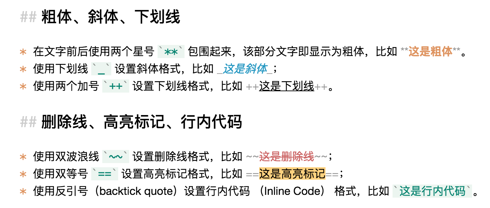

# 基本格式

## 文档的基本格式

本章介绍 Markdown 的基本格式，大部分情况下你只需掌握这些简单的格式就可以开始使用 Markdown 来书写文档了。

### 基本概念

Markdown 文档本质上是一种纯文本文档，所以没办法直接在文档里设置不同的文字大小、颜色、位置，也不能直接显示图片、表格等，但可以通过一些简单易记的符号用来标识这些格式和元素，然后通过 Markdown 渲染引擎就可以生成图文并茂、格式丰富的文档。

Yu Writer 的编辑器（即应用程序窗口中间部分）能够解析 Markdown 元素，并使用相应的样式来显示某些元素，比如设置为标题的文字会放大、设置为粗体的文字会加粗等，但实质上仍然是纯文本。对于表格、图片等非文本元素只能显示其原始的 Markdown 代码。

Yu Writer 窗口最右侧是即时预览面板，里面显示的是 Markdown 文档的渲染结果。如果你一开始不熟悉 Markdown， 可以一边书写一边瞥看窗口右侧渲染的结果，以便确认是否书写正确。

### 段落

一行文字即一个段落，段落是自动换行的，无需手动输入回车换行符。

### 粗体、斜体、下划线

* 在文字前后使用两个星号 `**` 包围起来，该部分文字即显示为粗体，比如 **这是粗体**。
* 使用下划线 `_` 设置斜体格式，比如 _这是斜体_；
* 使用两个加号 `++` 设置下划线格式，比如 ++这是下划线++。

### 删除线、高亮标记、行内代码

* 使用双波浪线 `~~` 设置删除线格式，比如 ~~这是删除线~~；
* 使用双等号 `==` 设置高亮标记格式，比如 ==这是高亮标记==；
* 使用反引号（backtick quote）设置行内代码 （Inline Code） 格式，比如 `这是行内代码`。


由于 GitBook 的限制，部分样式效果无法在此呈现，故使用图片

* 下划线（++ 正文 ++）
* 高亮标记（== 正文 ==）




### 标题（Heading）

Markdown 支持定义六级标题，设置标题时只需在一行文字前面添加 1 个到 6 个井号 `#` 和一个空格符即成为标题，比如上面的 `## 标题（Heading）` 即表示该行是一个二级标题。

对于一级标题和二级标题，还可以在该行文字下面分别使用一个到多个等号 `=` 或减号 `-` 来表示。例如：

```text
这是一级标题
==========

这是二级标题
----------
```

这种标题格式称为 Setext 风格，相应地，使用井号定义标题叫做 Atx 风格。一般情况下，在同一个文档里不要混用两种风格。

### 链接

点击工具栏的 `Link` 按钮，在弹出的窗口中输入链接的文字标题以及目标地址，即可在文档内插入一个超级链接 Markdown 代码。如果想修改链接代码的内容，可以直接在编辑器里修改，也可以右击链接代码，在弹出菜单选择 `Edit Link`。

### 图片

点击工具栏的 `Image` 按钮，在弹出的 `图片资源管理窗口` 中点击 `添加图片` 按钮，或者直接把图片拖进去，然后选中图片，再点击插入按钮即会在文档中插入一个图片 Markdown 代码。同样地，如果想修改图片代码的内容，可以直接在编辑器里修改，也可以右击图片代码，然后在弹出菜单选择 `Edit Image`，重新选择图片再点击更新按钮。

### 列表

在一行文字前使用一个星号 `*` 加一个空格符即成为一个列表项，比如：

* 这是第 1 个列表项
* 这是第 2 个列表项
* 这是第 3 个列表项

除了使用星号，还可以使用加号 `+` 和减号 `-` 来定义列表项，它们作用是一样的。如果要定义一个有序列表，则每行应该以一个数字开头，然后加一个点号 `.` 再加一个空格符，比如：

1. 这是第 1 个有序列表项
2. 这是第 2 个有序列表项
3. 这是第 3 个有序列表项

列表可以有层级关系，子级列表只需比上级列表在前多加两个空格即可，比如：

* 第一级第 1 项
  * 第二级第 1 项
  * 第二级第 2 项
* 第一级第 2 项
* 第一级第 3 项

### 插入脚注、目录、表格、图表、数学公式等

点击工具栏的 `Insert` 按钮，然后选择相应的功能即可。

