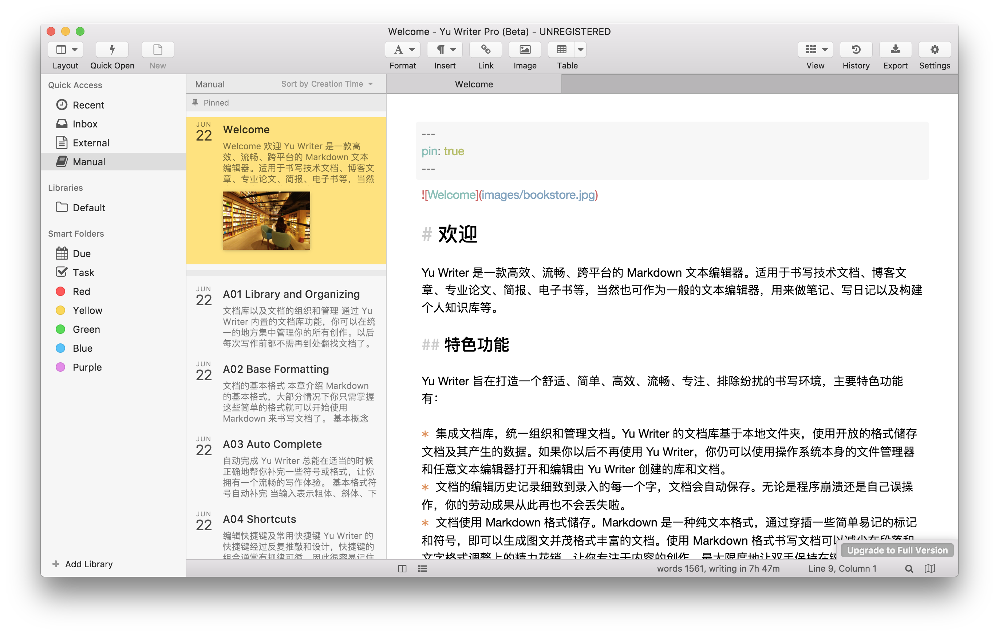
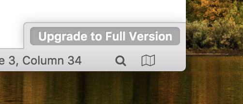

# 让我们开始吧

## 安装 Yu Writer

目前，您可以在 GitHub 和 临时官网 上下载开发中的 Yu Writer Beta 版。

* GitHub：[https://github.com/ivarptr/yu-writer.site/releases](https://github.com/ivarptr/yu-writer.site/releases)
* 官网：[https://ivarptr.github.io/yu-writer.site/](https://ivarptr.github.io/yu-writer.site/)


请注意：Yu Writer 正处于开发阶段，稳定性将无法保障，遇到应用崩溃和 Bug，请 [提交 issues 至 GitHub](https://github.com/ivarptr/yu-writer.site/issues)。部分功能可能尚未完成。


当您完成下载并启动 Yu Writer 后，您将会看到像这样的界面：


您打开后所看到的界面可能与上图有所不同，这取决于您使用的操作系统、应用版本和所选语言。


## 升级至 Yu Writer Pro

### 为什么要升级至 Pro？

目前 Yu Writer Beta 版的核心功能是免费的。但是如果你喜欢本软件，或者觉得本软件对您有帮助，或者认可作者的努力，或者认为作者很帅 😅， 或者是在企业或商业环境中使用，或者以上都不是，只是有一股莫名想花钱的冲动 😂。 那就请考虑一下注册本软件吧。

### Pro 版与普通版的区别

* 能下载并使用 Develop 版（开发版），能更快地体验到作者正在开发的新功能；
* 能完整体验所有功能，软件中标有锁头图标的功能在注册后即可使用 （注：标有 \* 号的功能尚未完成，注册后也暂时无法使用，以后会陆续补完。）；
* 能使用更多的 UI 主题、文档样式和幻灯片样式（0.5.x 版尚未丰富）；
* 能使用自定义的主题、模版、文档样式和幻灯片样式（此项 0.5.x 版尚未支持）；
* 授权可用于 0.x 版的测试版和开发版，同样也可用于将来发布的 1.x 的正式版和开发版；
* 有了您的注册支持，作者就能愉快地、持续地修复、改进、更新软件，软件会变得越来越好用。（咦！好像这个才是重点？才才才不是呢 😋）

### 如何升级？

打开 Yu Writer，点击右下角的 `Upgrade to Full Version` 并按提示操作即可

## 完成！

现在您可以开始享用您的 Yu Writer 了！若要了解如何更好地使用 Yu Writer，请继续阅读我们的使用手册。

